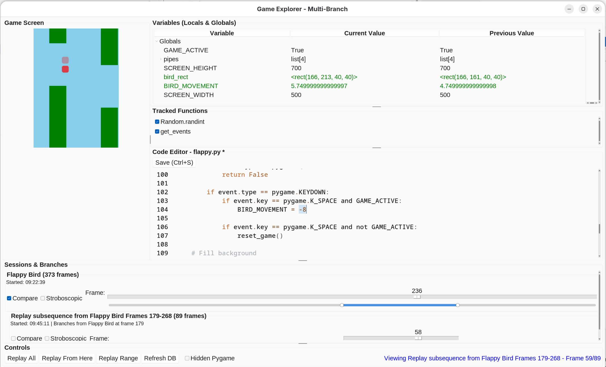
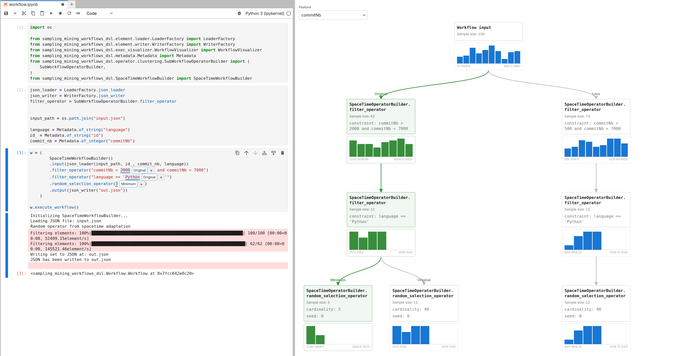
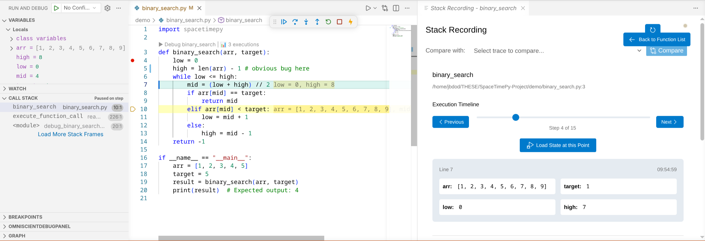

# SpaceTimePy-Project
A repo combining all SpaceTimePy related repo with VSCode configuration.


## Install

```bash
git clone https://github.com/jbdoderlein/SpaceTimePy-Project
cd SpaceTimePy-Project
uv venv
uv sync
source .venv/bin/activate
```

## Demos

### Pygame

First play the first game session to collect the initial trace :

```bash
cd demo
python flappy.py
```

Then you can launch the tool with

```bash
uv run -m spacetimepy_pygame.gameexplorer flappy.db
```



### Sampling Workflow (JupyterLab)

First start the jupyter-lab server

```bash
jupyter-lab demo/workflow.ipynb
```

In web interface open `workflow.ipynb` and execute all cell. A side windows should open with variant graph, and some variant should be already present in the workflow code cell.



### Omniscient Live Debugger (VSCode)

First start the vscode with extension inside

```bash
./launch_vscode .
```

Then open the file `demo/binary_search.py`



You can additionaly see the trace web explorer by launching : 

```bash
web-spacetimepy .vscode/spacetimepy.db --port 8001
```
